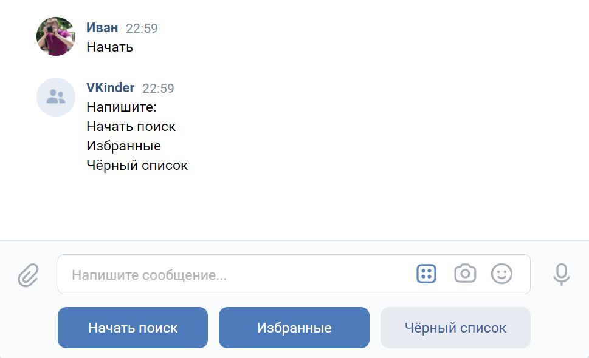
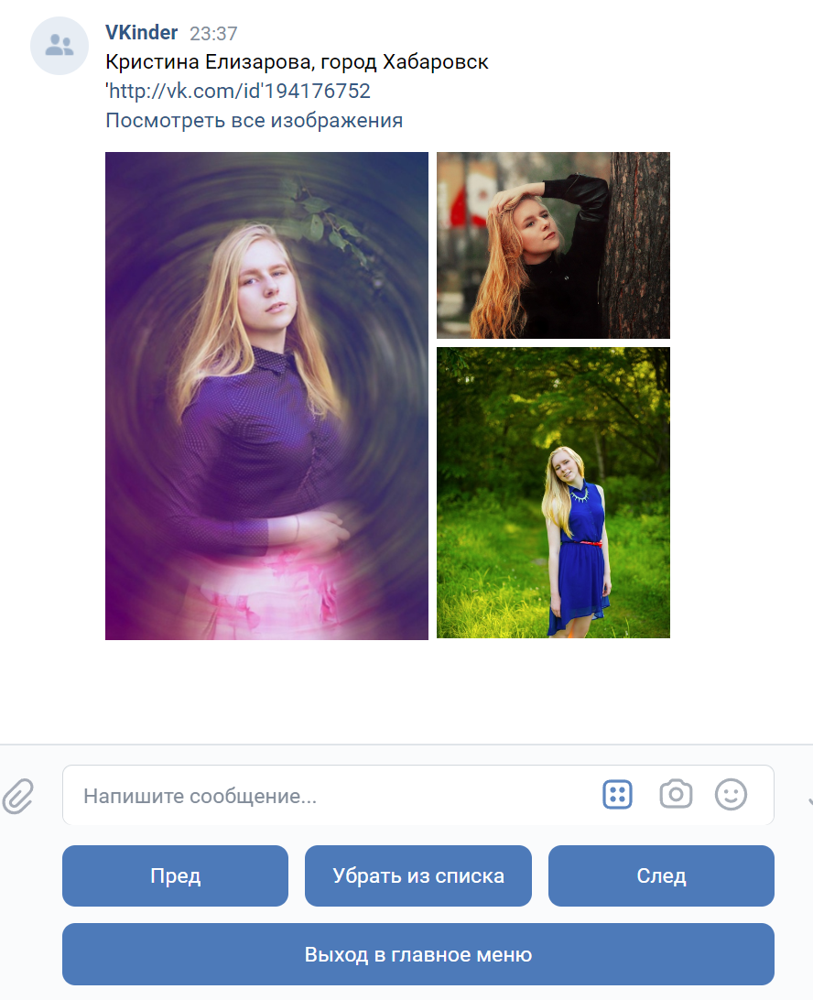

## Описание программы VKinder
Программа-бот VKinder разработана для знакомства людей в социальной сети ВКонтакте.  
В программе реализован поиск людей по параметрам: возраст, пол и город.  

По результатам поиска пользователей ВКонтакте выводится информация в диалоговом окне чата о найденном пользователе в виде: имя и фамилия, ссылка на профиль, три фотографии со страницы.

В процессе поиска пользователь имеет возможность просматривать страницу найденного профиля, добавлять его в список избранных или черный список, ставить "лайк" фото.

## Взаимодействие с ботом
Взаимодействие с ботом осуществляется в мобильном приложении ВКонтакте или на сайте vk.com через группу VKinder. Пользователь при этом должен быть зарегестрирован в социальной сети ВКонтакте.
 
Для более точного поиска людей желательно, чтобы в анкете пользователя бота имелись данные по возрасту, полу и городу.

[Для работы бота необходимо получить токен с необходимыми правами доступа и настроить группу ВКонтакте.](get_and_set_values.MD)

## Запуск бота 
Для запуска проекта выполнить команду python main.py

## Управление ботом
1. Для начала работы бота необходимо в чате написать любое сообщение.

2. Пользователю будет предложено выбрать или написать необходимое действие на выбор: "Начать поиск", "Избранные", "Черный список".
 
    "Начать поиск" - процесс поиска людей.
  
    "Избранные" - показать информацию о пользователях, которые заинтересовали.     
    "Черный список" - показать информацию о пользователях, которые не заинтересовали. 
 

3. При выборе действия "Начать поиск" пользователю бота будет предложено написать интересующий возраст партнера, после чего начнется поиск пользователей по параметрам.

4. После заврешения поиска пользователю бота появится информация о найденном пользователе.

5. В диалоговом окне можно выполнить следующие действия: 
    - перейти по ссылке профиля;
    - кнопка "Пред" - показать предыдущий профиль;
    - кнопка "След" - показать следующий профиль;
    - кнопка "Добавить в избранное" - добавить профиль в список избранных. Появится сообщение "Партнёр добавлен в cписок избранных";
    - кнопка "Добавить в черный список" - добавить профиль в черный список. Появится сообщение "Партнёр добавлен в чёрный cписок";
    - кнопка "Выход в главное меню" - вернутся в главное меню бота.
 
    
Пользователи добавленные в один из списков не будут показанны при следующем поиске.  
Любого пользователя можно удалить из списка "Избранные" и "Черный список".
