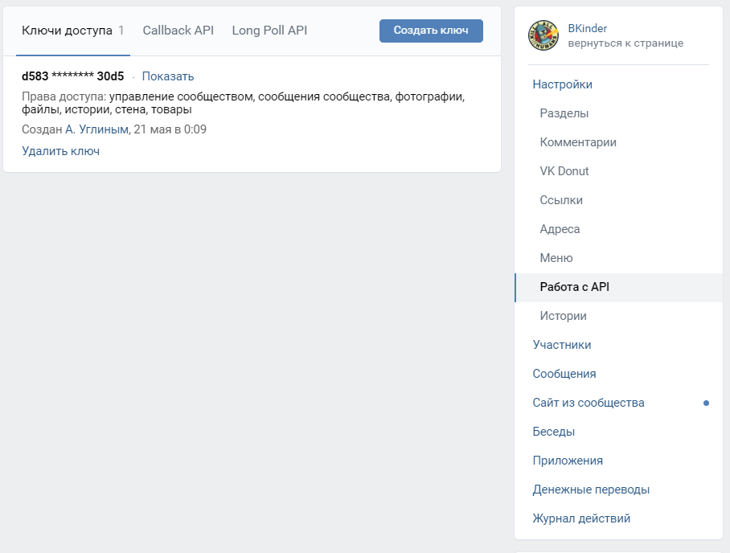
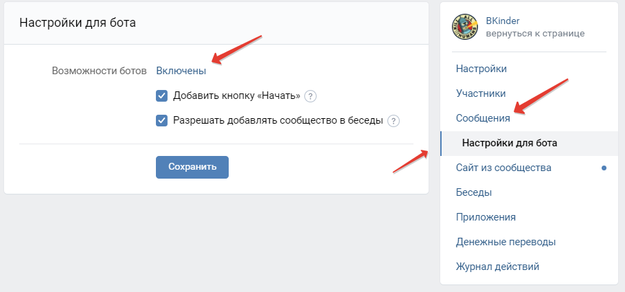
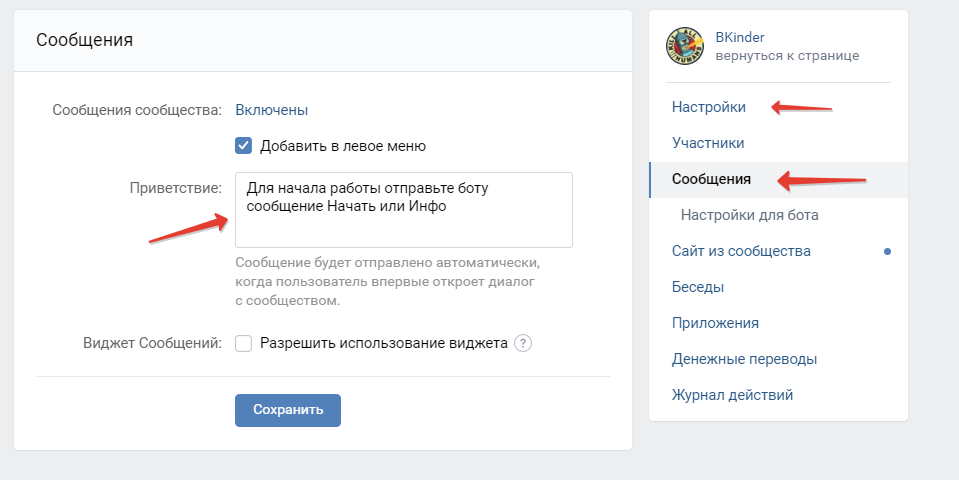
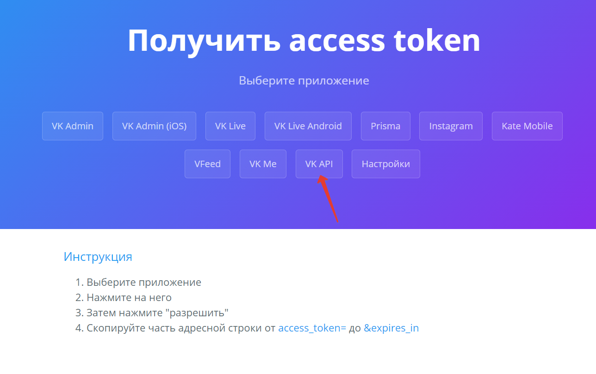
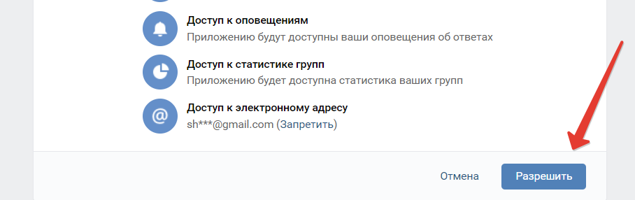
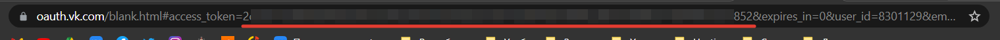

## Как настроить группу для бота и получить токен
1.1 Создать группу в VK

1.2 Зайти в Управление -> Работа с API. Создать ключ.

1.3 Включить возможность писать сообщения в группу. Управление -> Сообщения -> Сообщения сообщества: включить.

1.4 Настройки бота. Возможности бота: Включены   
&nbsp;&nbsp;&nbsp;&nbsp;
Так же здесь можно добавить кнопку "Начать", чтобы пользователю было с чего начать диалог с ботом 

1.5 Настройки бота. Чтобы пользватель знал как начать диалог с ботом. Настраиваем привественное сообщение
]

## Как получить токен пользователя
2.1 Перейти по ссылке https://vkhost.github.io/

2.2 Выбрать VK API

2.3 На следующей странице дать разрешения

2.4 На следующей странице из адресной строки от access_token= до &expires_in скопировать токен.
