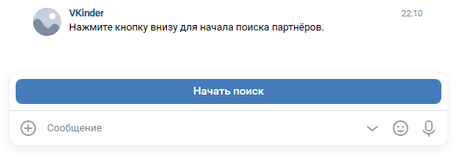

## Описание программы VKinder
Программа-бот VKinder разработана для знакомства людей в социальной сети ВКонтакте.

В программе реализован поиск людей по параметрам: возраст, пол и город.

По результатам поиска пользователей ВКонтакте выводится информация в диалоговом окне чата о найденном пользователе в виде: имя и фамилия, возраст, город, ссылка на профиль, три фотографии со страницы.

В процессе поиска пользователь имеет возможность просматривать страницу найденного пользователя, добавлять его в список избранных или чёрный список, а также удалять из этих списков.

## Взаимодействие с ботом
Взаимодействие с ботом осуществляется в мобильном приложении ВКонтакте или на сайте vk.com через группу VKinder. Пользователь при этом должен быть зарегистрирован в социальной сети ВКонтакте.
 
Для более точного поиска людей желательно, чтобы в профиле пользователя бота имелись данные по возрасту, полу и городу.

[Для работы бота необходимо получить токен с необходимыми правами доступа и настроить группу ВКонтакте.](Documentation/get_and_set_values.MD)

## Установка и запуск бота
1. Клонируем репозиторий:
   ```bash
   git clone https://github.com/selivados/2_Coursework_VKinder`
   ```
2. Переходим в папку `2_Coursework_VKinder`:
   ```bash
   cd 2_Coursework_VKinder
   ```
3. Создаем виртуальное окружение:
   ```bash
   python -m venv venv
   ```
4. Активируем виртуальное окружение:
   ```bash
   venv/Scripts/activate
   ```
5. Устанавливаем зависимости:
   ```bash
   pip install -r requirements.txt
   ```
6. В корневой папке проекта создаем файл `.env` в соответствии с шаблоном `env.example`
7. Создаем базу данных, с учетом настроек указанных в файле `.env`:  
   ```bash
   createdb -U <DB_USER> <DB_NAME>
   ```
8. Запускаем бота:
   ```bash
   python main.py
   ```

## Управление ботом
1. Для начала работы бота необходимо написать любое сообщение в группу VKinder.
2. Если для начала поиска не хватает данных (возраст, пол, город), пользователю будет предложено ввести их.
3. После получения всех необходимых данных пользователь может начать поиск, нажав на соответствующую кнопку.  

4. При нажатии на кнопку "Начать поиск" начинается поиск партнёров по параметрам пользователя бота.
5. По завершении поиска пользователю выводится информация о найденных партнёрах.  
  
Доступные действия:
    - перейти по ссылке профиля;
    - кнопка "<< Предыдущий" - показать предыдущего партнёра;
    - кнопка "Следующий >>" - показать следующего партнёра;
    - кнопка "Добавить в чёрный список" - добавить партнёра в чёрный список;
    - кнопка "Добавить в список избранных" - добавить партнёра в список избранных;
    - кнопка "Выход в главное меню" - вернуться в главное меню.
6. При нажатии на кнопку "Выход в главное меню" пользователь попадает в главное меню.  
  
Доступные действия:
    - кнопка "Список партнёров" - показать список найденных партнёров;
    - кнопка "Чёрный список" - показать партнёров, добавленных в чёрный список;
    - кнопка "Список избранных" - показать партнёров, добавленных в список избранных.
7. При нажатии на кнопку "Список избранных" пользователь переходит к просмотру избранных партнёров.  
  
Доступные действия:
    - кнопка "<< Предыдущий" - показать предыдущего партнёра;
    - кнопка "Следующий >>" - показать следующего партнёра;
    - кнопка "Удалить из списка избранных" - удалить партнёра из списка избранных;
    - кнопка "Выход в главное меню" - вернуться в главное меню.

Аналогично происходит просмотр чёрного списка.  
Пользователи добавленные в список избранных или чёрный список не будут показаны при просмотре списка партнёров и при следующем поиске.  
